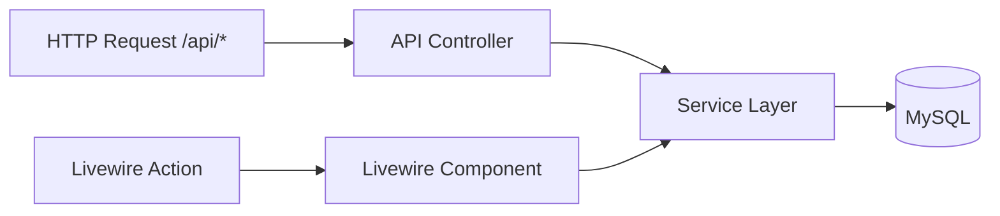

# notion-lite-laravel

A self-hosted, Kanban-style task management app with a web UI and a REST API, built on the TALL stack.

## Why this exists

Most task management tools are either too heavy to self-host or too closed to extend. This project gives you a working board-and-task system you can run locally or deploy yourself, with a REST API alongside the web interface so you can integrate it with other tools.

## Tech Stack

* PHP 8.2+
* Laravel 12
* Livewire 3 + Volt
* Flux UI
* Tailwind CSS + Alpine.js
* Laravel Sanctum (API token auth)
* MySQL 8.0
* Laravel Sail (Docker)

## Features

* Create boards and invite other registered users to collaborate on them
* Organize boards into sections (e.g. "To Do", "In Progress", "Done")
* Create tasks within sections, assign them to users, update their status, and archive them
* Comment on tasks with threaded replies
* Full REST API protected by Sanctum tokens for external integrations or mobile clients

## Architecture

Both the Livewire web UI and the REST API controllers delegate to a shared service layer. Neither talks directly to Eloquent models. Authorization and business logic live in the service classes, ensuring both interfaces behave consistently.



## Installation

### Requirements

* PHP 8.2+
* Composer
* Node.js
* Docker (optional, for Sail)

### Clone and Install Dependencies

```bash
git clone https://github.com/Shawky-dev/notion-lite-laravel.git
cd notion-lite-laravel

composer install

cp .env.example .env
php artisan key:generate
```

### Using Laravel Sail (Docker)

```bash
./vendor/bin/sail up -d
./vendor/bin/sail artisan migrate --seed
./vendor/bin/sail npm install
./vendor/bin/sail npm run dev
```

The application will be available at:

* App: `http://localhost`
* Vite Dev Server: `http://localhost:5173`

### Without Docker

The default `.env.example` is configured for SQLite.

```bash
php artisan migrate --seed
composer run dev
```

## Usage

### Register a User

```bash
curl -X POST http://localhost/api/register \
  -H "Content-Type: application/json" \
  -d '{
    "name": "Alice",
    "email": "alice@example.com",
    "password": "secret123"
  }'
```

### Log In and Obtain a Token

```bash
curl -X POST http://localhost/api/login \
  -H "Content-Type: application/json" \
  -d '{
    "email": "alice@example.com",
    "password": "secret123"
  }'
```

### Create a Board

```bash
curl -X POST http://localhost/api/board/create \
  -H "Authorization: Bearer YOUR_TOKEN" \
  -H "Content-Type: application/json" \
  -d '{
    "title": "Q3 Planning"
  }'
```

### Create a Section

```bash
curl -X POST http://localhost/api/section/create/{board_id} \
  -H "Authorization: Bearer YOUR_TOKEN" \
  -H "Content-Type: application/json" \
  -d '{
    "title": "In Progress"
  }'
```

### Web Interface

Visit:

```text
http://localhost/register
```

to create an account and start using the application through the browser.

## Running Tests

```bash
./vendor/bin/sail composer test
```

Tests use Pest and run against an isolated testing database. The configuration cache is cleared automatically before each test run.

## Known Limitations

* No real-time synchronization between users
* No file attachments on tasks
* REST API list endpoints do not currently support pagination
* Designed for personal use and small teams
* No fine-grained role-based permissions beyond board membership

## License

Released under the MIT License.
